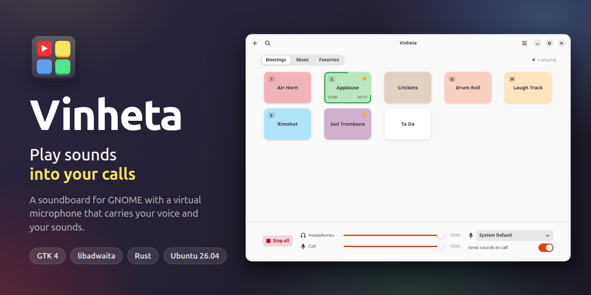

# Vinheta

A soundboard for GNOME that plays sounds into your calls.



Add your folders of sounds, and each one becomes a tab with a pad per sound. Click a pad, or press its key, to play it. While Vinheta runs it provides a virtual microphone named "Vinheta" that carries your voice together with the sounds, so the other side of a call hears both, and you hear the sounds on your own headphones.

- One tab per folder, kept in sync with the folder while the app runs.
- Pads with a name, a color, a volume, a loop, and a key.
- Favorites, search, and sorting by name or by most recent file.
- Separate volumes for your headphones and for the call.
- "Send sounds to call" and "Include my voice" switches.
- English and Brazilian Portuguese.

## Install

Vinheta is packaged for Ubuntu 26.04. Download the `.deb` of the [latest release](https://github.com/wilfison/Vinheta/releases/latest) and install it:

```sh
sudo apt install ./vinheta_VERSION_amd64.deb
```

## Use it in a call

1. **Choose "Vinheta" as the microphone.** In the audio settings of your call app, select "Vinheta" as the microphone (input device). Your voice and your sounds go through it.
2. **Turn off noise suppression.** Call apps treat sounds as noise and cut them out. Turn off noise suppression or noise cancellation in the call app.
3. **Use headphones.** With speakers, your microphone picks the sounds up again and the call hears them twice.
4. **Keep Vinheta open.** The "Vinheta" microphone exists only while the app is running.

The app shows this guide on its first run, and again from the menu ("Call Setup Guide").

## Build from source

Vinheta is written in Rust with GTK 4 and libadwaita, and built with Meson. On Ubuntu 26.04:

```sh
sudo apt build-dep ./          # the build dependencies of debian/control
scripts/run-dev.sh             # builds, installs into build/install, and runs
scripts/check.sh               # the checks to run before a commit
scripts/build-deb.sh           # builds the .deb under tmp/deb
```

The documentation is in [docs/](docs/): start with [docs/overview.md](docs/overview.md) and [docs/architecture.md](docs/architecture.md). [docs/development.md](docs/development.md) and [docs/checks.md](docs/checks.md) cover building and the checks, and [docs/audio.md](docs/audio.md) the audio engine.

## License

Vinheta is free software, released under the [GNU General Public License, version 3 or later](COPYING).
